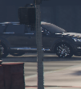
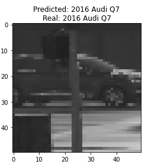
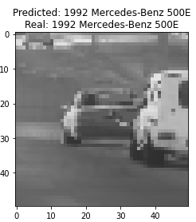
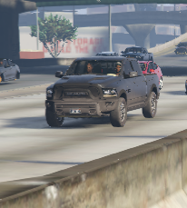
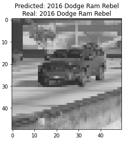
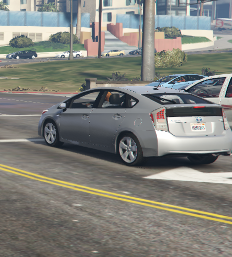
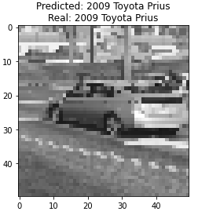

# vehicle-classification

[](https://jupyter.org/try)


## Description
`vehicle-classification` aggregates labeled vehicle images and classifies vehicle images on granularity of make, model, and generation. `vehicle-classification` leverages [Grand Theft Auto V (GTA V)](https://en.wikipedia.org/wiki/Grand_Theft_Auto_V) for labeled vehicle image aggregation (data set collection) and [PyTorch](https://pytorch.org/) to build a convolutional neural network (CNN) architecture to perform vehicle image classification on the granularity of make, model, and generation (e.g. '1992 Mercedes-Benz 500E', '2016 Audi Q7', '2016 Dodge Ram Rebel').

## Examples

The following are examples of images classified by the classifier.

<p float="left" align="center">
  
  
</p>

<p float="left" align="center">
  
  
</p>

<p float="left" align="center">
  
  
</p>

<p float="left" align="center">
  
  
</p>

## Data Set Collection

### Environment

Windows 10 is required for data set collection. The software used for data set collection is as follows:

| Software/File                     | Version    | Link
| --------------------------------- | ---------- | ------------------------------------------------------------------------------------------------------------
| Grand Theft Auto V                | 1.0.2060.1 | [Epic Games](https://www.epicgames.com/store/en-US/product/grand-theft-auto-v)
| OpenIV                            | 4.0        | [OpenIV](https://openiv.com/)
| Script Hook V                     | 1.0.2060.1 | [AB Software Development](http://www.dev-c.com/gtav/scripthookv/)
| Community Script Hook V .NET      | 3.0.4      | [GTA5-Mods](https://www.gta5-mods.com/tools/scripthookv-net)
| Gameconfig for Limitless Vehicles | 21.0       | [GTA5-Mods](https://www.gta5-mods.com/misc/gta-5-gameconfig-300-cars)
| Heap Limit Adjuster               | 1.0.0      | [GTA5-Mods](https://www.gta5-mods.com/tools/heap-limit-adjuster-600-mb-of-heap)
| Packfile Limit Adjuster           | 1.1        | [GTA5-Mods](https://www.gta5-mods.com/tools/packfile-limit-adjuster)
| NativeUI                          | 1.9.1      | [GTAForums](https://gtaforums.com/topic/809284-net-nativeui/)
| GTA 5 Replace Carpack             | 1.1        | [Google Drive](https://drive.google.com/u/0/uc?export=download&confirm=y9JT&id=0B4Rh07XTbbiVR01uVlBZckhFMzg)

### Configuration

After the necessary applications and files have been installed and obtained respectively, use the following steps to prepare for data collection:

1. Extract the ZIP archives for `Community Script Hook V .NET`, `Gameconfig for Limitless Vehicles`, `Heap Limit Adjuster`, `Packfile Limit Adjuster`, and `NativeUI`.
2. Create `mods` and `scripts` directories in the GTA V game root directory (`GTAV`).
3. Launch `OpenIV`, select `GTAV -> Windows`, and locate the GTA V game root directory (`GTAV`) to specify installation location.
4. Click the `Edit mode` button to enter edit mode and select `Yes` to continue. Note that the `Edit mode` button will be highlighted in blue when `OpenIV` is in edit mode.
5. Click the `ASI Manager` button to install ASI Loader and the OpenIV.ASI plugin for GTA V.
6. Click `Install` for ASI Loader and OpenIV.ASI.
7. From a `File Explorer` window, drag `GTA 5 Replace Carpack v.1.1.oiv` onto the `OpenIV` window.
8. Click the `Install*` button in `OpenIV`.
9. Select `"mods" folder` as the installation location.
10. Click the `Install* Confirm Installation` button to confirm installation.
11. When `Installation succeeded` is displayed, click `Close`.
12. Navigate to `GTA V/update/update.rpf` in `OpenIV`, select `Show in "mods" folder`, and navigate to `common/data`.
13. From a `File Explorer` window, drag `395267-GTAV Config v21.0\Gta Config v21 for v 1.0.2060\1,5x traffic\gameconfig.xml` to `OpenIV`.
14. Between `File Explorer` windows, drag `3ef57d-GTAV.HeapAdjuster\GTAV.HeapAdjuster.asi` to the GTA V game root directory (`GTAV`), replacing if prompted.
15. Between `File Explorer` windows, drag `NativeUI.dll` to the `GTAV\scripts` directory, replacing if prompted.
16. Between `File Explorer` windows, drag `c901a6-PackfileLimitAdjuster\PackfileLimitAdjuster.asi` and `c901a6-PackfileLimitAdjuster\PackfileLimitAdjuster.ini` to the GTA V game root directory (`GTAV`), replacing if prompted.
17. Between `File Explorer` windows, drag `ScriptHookV_1.0.2060.1\bin\dinput8.dll` and `ScriptHookV_1.0.2060.1\bin\ScriptHookV.dll` to the GTA V game root directory (`GTAV`), replacing if prompted.
18. Between `File Explorer` windows, drag `ScriptHookVDotNet\ScriptHookVDotNet.asi`, `ScriptHookVDotNet\ScriptHookVDotNet2.dll`, and `ScriptHookVDotNet\ScriptHookVDotNet3.dll` to the GTA V game root directory (`GTAV`), replacing if prompted.

### Compilation

If you wish to build the `GTAVehicleClassification.dll` from source, the files `DeveloperConsole.dll` and `VehicleLabeler.cs` can be used to build `GTAVehicleClassification.dll` with Microsoft Visual Studio. `VehicleLabeler.cs` can be found in the `vehicle-classification\data_collection` directory. `DeveloperConsole.dll` and a pre-built `GTAVehicleClassification.dll` can be found in the `vehicle-classification\data_collection\dlls` directory.

### Execution

To begin data collection, use the following steps:

1. Copy `DeveloperConsole.dll` and `GTAVehicleClassification.dll` to the `GTAV\scripts` directory.
2. Create the directories `GTAV\scripts\images` and `GTAV\scripts\debug_images`.
3. Launch the Grand Theft Auto V game.

Data collection will begin, storing images and image metadata to the `GTAV\scripts\images` directory.

### Post-processing

To organize the collected labeled data into directories such that each directory is named with an identifier for the vehicle whose images it holds, use the following steps:

1. Copy the `GTA\scripts\images` directory to the `vehicle-classification` directory.
2. Create the directory `vehicle-classification\processed_images`.
3. Navigate to `vehicle-classification\processing`.
4. Run `python process.py`. (OpenCV is required to execute this script.)

Directories (one for each unique vehicle for which there were images collected) should be created in the `vehicle-classification\processed_images` directory.

## Classification

### Environment

Navigate to the `vehicle-classification` directory and setup a new `conda` environment using the following commands.

```
conda create -n vc python=3.8.5 -y
conda activate vc
conda install ipykernel -y
ipython kernel install --user --name=vc
```

### Dependencies

Install the dependencies using the following command.

`pip install -r requirements.txt`

### Execution

To train and test the classifier, run the cells of the Jupyter notebook `classifier.ipynb`, using `jupyter lab`, ensuring the `vc` kernel is selected.

Example training data is available in the `training_data.npy` file.

### Results

The accuracy of the classifier on GTA V vehicle images is around 70%. The following is a loss vs. epoch plot for the classifier's training stage:

<p float="left" align="center">
  
</p>

## Authors

* Rishi Masand
